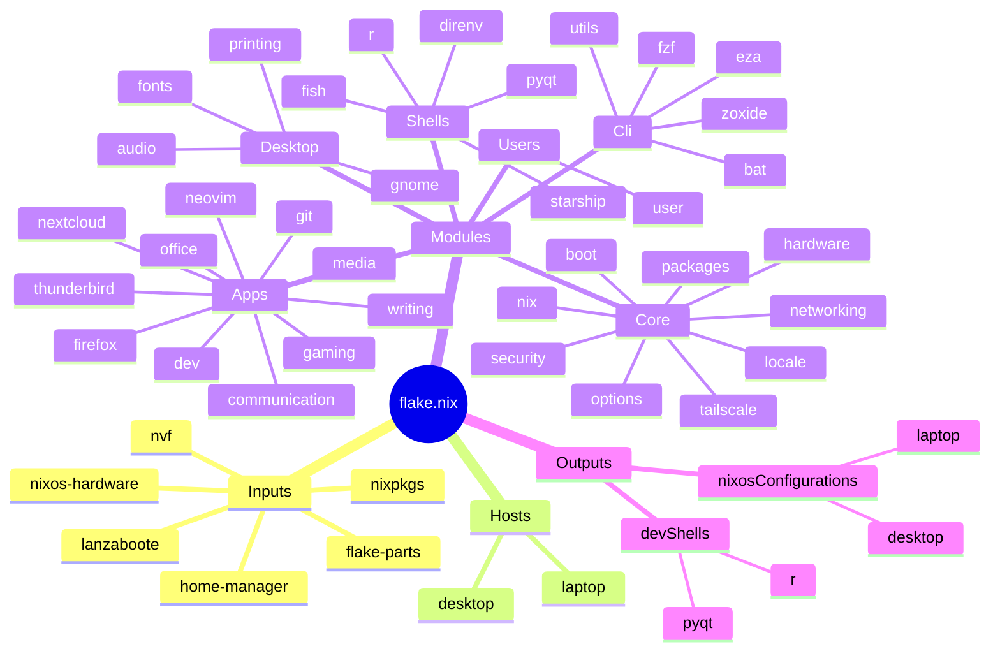

# NixOS Configuration

Welcome to my NixOS configuration!

## Flake Map

<!-- FLAKE_MAP_START -->

```mermaid
mindmap
  root((flake.nix))
    Inputs
      flake-parts
      home-manager
      lanzaboote
      nixos-hardware
      nixpkgs
      nvf
    Hosts
      desktop
      laptop
    Modules
      Apps
        communication
        dev
        firefox
        gaming
        git
        media
        neovim
        nextcloud
        office
        thunderbird
        writing
      Cli
        bat
        eza
        fzf
        utils
        zoxide
      Core
        boot
        hardware
        locale
        networking
        nix
        options
        packages
        security
        tailscale
      Desktop
        audio
        fonts
        gnome
        printing
      Shells
        direnv
        fish
        pyqt
        r
        starship
      Users
        user
    Outputs
      devShells
        pyqt
        r
      nixosConfigurations
        desktop
        laptop
```
<!-- FLAKE_MAP_END -->
