# NixOS Configuration

My modular and declarative NixOS setup managed via Flakes. It is built around the [Dendritic Pattern](https://github.com/mightyiam/dendritic), which heavily utilizes [flake-parts](https://flake.parts) to organize system configs and reusable feature modules across different hosts.

This flake uses a few more prominent community projects that I highly recommend:
- [lanzaboote](https://github.com/nix-community/lanzaboote) for Secure Boot support.
- [nvf](https://github.com/notashelf/nvf) for super simple Neovim configurations.
- [home-manager](https://github.com/nix-community/home-manager) for declarative user environments.
- [nixos-hardware](https://github.com/NixOS/nixos-hardware) for host-specific hardware quirks.

## Architecture Map

The flowchart below visualizes the entire flake architecture. It is **auto-generated** on push by a GitHub Action that parses the Nix schema (`nix flake show` & `metadata`) and scans the local repository structure to map inputs, local modules, and final outputs.

## Flake Map

```mermaid
graph TD
  classDef flake fill:#5277C3,stroke:#fff,stroke-width:2px,color:#fff,font-weight:bold,rx:10,ry:10;
  classDef input fill:#7EBAE4,stroke:#5277C3,stroke-width:2px,color:#111,rx:5,ry:5;
  classDef local fill:#7EBAE4,stroke:#5277C3,stroke-width:2px,color:#111,rx:5,ry:5;
  classDef output fill:#5277C3,stroke:#7EBAE4,stroke-width:2px,color:#fff,rx:5,ry:5;
  Flake[flake.nix]:::flake

  subgraph Inputs [Flake Inputs]
    direction TB
    in_flake_parts[flake-parts]:::input
    in_home_manager[home-manager]:::input
    in_lanzaboote[lanzaboote]:::input
    in_nixos_hardware[nixos-hardware]:::input
    in_nixpkgs[nixpkgs]:::input
    in_nvf[nvf]:::input
  end
  Inputs --> Flake

  subgraph Local [Local Repository]
    direction TB
    subgraph h_Hosts [Hosts]
      direction TB
      h_desktop[desktop]:::local
      h_laptop[laptop]:::local
    end
    subgraph m_Modules [Modules]
      direction TB
      subgraph cat_apps [Apps]
        direction TB
        m_apps_communication_nix[communication.nix]:::local
        m_apps_dev_nix[dev.nix]:::local
        m_apps_firefox_nix[firefox.nix]:::local
        m_apps_gaming_nix[gaming.nix]:::local
        m_apps_git_nix[git.nix]:::local
        m_apps_joplin_nix[joplin.nix]:::local
        m_apps_media_nix[media.nix]:::local
        m_apps_neovim_nix[neovim.nix]:::local
        m_apps_nextcloud_nix[nextcloud.nix]:::local
        m_apps_office_nix[office.nix]:::local
        m_apps_thunderbird_nix[thunderbird.nix]:::local
        m_apps_writing_nix[writing.nix]:::local
        m_apps_zotero_nix[zotero.nix]:::local
      end
      subgraph cat_cli [Cli]
        direction TB
        m_cli_bat_nix[bat.nix]:::local
        m_cli_eza_nix[eza.nix]:::local
        m_cli_fzf_nix[fzf.nix]:::local
        m_cli_utils_nix[utils.nix]:::local
        m_cli_zoxide_nix[zoxide.nix]:::local
      end
      subgraph cat_core [Core]
        direction TB
        m_core_boot_nix[boot.nix]:::local
        m_core_hardware_nix[hardware.nix]:::local
        m_core_locale_nix[locale.nix]:::local
        m_core_networking_nix[networking.nix]:::local
        m_core_nix_nix[nix.nix]:::local
        m_core_options_nix[options.nix]:::local
        m_core_packages_nix[packages.nix]:::local
        m_core_security_nix[security.nix]:::local
        m_core_tailscale_nix[tailscale.nix]:::local
      end
      subgraph cat_desktop [Desktop]
        direction TB
        m_desktop_audio_nix[audio.nix]:::local
        m_desktop_fonts_nix[fonts.nix]:::local
        m_desktop_gnome_nix[gnome.nix]:::local
        m_desktop_printing_nix[printing.nix]:::local
      end
      subgraph cat_shells [Shells]
        direction TB
        m_shells_direnv_nix[direnv.nix]:::local
        m_shells_fish_nix[fish.nix]:::local
        m_shells_pyqt_nix[pyqt.nix]:::local
        m_shells_r_nix[r.nix]:::local
        m_shells_starship_nix[starship.nix]:::local
      end
      subgraph cat_users [Users]
        direction TB
        m_users_user_nix[user.nix]:::local
      end
    end
  end
  Local --> Flake

  subgraph Outputs [Flake Outputs]
    direction TB
    out_devShells_x86_64_linux_pyqt[devShells.x86_64-linux.pyqt]:::output
    out_devShells_x86_64_linux_r[devShells.x86_64-linux.r]:::output
    out_nixosConfigurations_desktop[nixosConfigurations.desktop]:::output
    out_nixosConfigurations_laptop[nixosConfigurations.laptop]:::output
  end
  Flake --> Outputs
```

<!-- FLAKE_MAP_START -->

<!-- FLAKE_MAP_END -->
